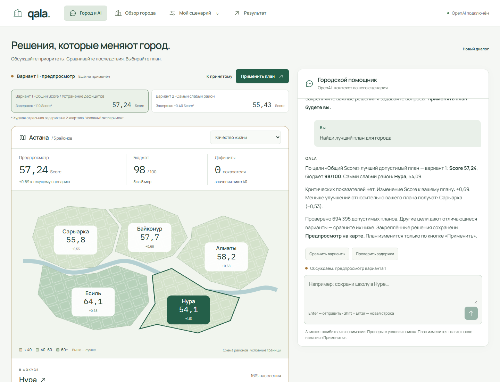
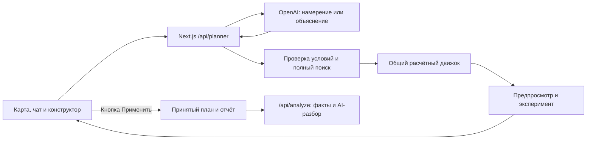

# QALA — Аким на 5 часов

**Обсудите приоритеты. Увидьте последствия. Примите решение.**

AI-симулятор для городского управленца, аналитика и участника учебной симуляции. QALA помогает распределить ограниченный бюджет между инициативами и увидеть, какие районы выиграют, где сохранятся дефициты и насколько результат зависит от сроков реализации.

**Astana Innovations · HackAlem AI · команда chrollo**

[Запуск](#быстрый-запуск) · [Проверка для жюри](#как-проверить-решение) · [Архитектура](#архитектура) · [Методика](docs/MODEL.md) · [Сверка данных](docs/SOURCE-AUDIT.md)



## Задача и ценность

У города **100 единиц бюджета**, **5 районов**, **10 показателей** и **14 мероприятий**. Нужно выбрать ровно пять мер с учётом стоимости, задержек, несовместимостей и взаимного усиления. Максимальный общий балл и максимальная помощь слабейшему району могут приводить к разным решениям.

QALA переводит запрос в явные условия, перебирает допустимые планы, показывает последствия на карте и объясняет компромиссы. Полный поиск без дополнительных условий даёт:

| Цель                                  |   Общий Score | Балл слабейшего района | Показателей ниже 40 |
| ------------------------------------- | ------------: | ---------------------: | ------------------: |
| Максимальный общий Score              | **57,236735** |               54,09125 |               **0** |
| Максимальная помощь слабейшему району |      55,43026 |            **55,2625** |                   2 |

Во втором случае слабейший район получает более высокий балл, но остаются дефициты школ и медицины в Нуре. **Приложение показывает цену выбранного приоритета.** Оба результата получены из **694 395 допустимых планов** и воспроизводятся тестами.

## Что реализовано

- **Город и чат рядом.** Интерактивная схема районов, переключение десяти показателей, районные оценки и изменения относительно базы сравнения. На телефоне — вкладки карты и диалога.
- **Подбор через диалог.** Закрепление решений, исключение мер, смена цели, сравнение и объяснение. Условия можно проверить и изменить вручную. Ответы поддерживают Markdown, списки и таблицы.
- **Полный поиск.** Перебор допустимых наборов и назначений районов; победители по нескольким целям. Неупомянутые условия сохраняются.
- **Предпросмотр и отдельное применение.** Найденный вариант появляется на карте. Переключение вариантов и эксперименты не заменяют принятый план; итог применяется кнопкой.
- **Проверка задержек.** Для каждого кандидата автоматически проверяется задержка каждой из пяти мер на два квартала. В отдельном эксперименте можно выбрать меру и задержку от 1 до 8 кварталов; карта показывает последствия.
- **Конструктор и отчёт.** Контроль бюджета и конфликтов, сравнение сценариев, точный вклад Шепли, лучшая замена одной меры, AI-анализ с раскрываемыми фактами, JSON-экспорт и ссылка на сценарий.

> [!NOTE]
> Симуляция, полный поиск, карта, задержки и расчётный отчёт работают **без OpenAI-ключа**. Для свободного диалога и AI-объяснений нужен ключ. Локальный разбор явно обозначен и не выдаётся за ответ AI.

## Как работает решение

1. **Задать приоритет:** например, «Сохрани школу и поликлинику, улучши остальное». Можно задать условия вручную или собрать план в конструкторе.
2. **Проверить условия:** OpenAI преобразует сообщение в структурированное намерение. Сервер проверяет изменения и сохраняет остальные ограничения.
3. **Исследовать варианты:** код рассчитывает планы; карта показывает предпросмотр, бюджет, дефициты и районные изменения. Можно сравнить другую цель и проверить задержку, продолжая диалог.
4. **Применить план:** только кнопка «Применить план» меняет текущий сценарий. Раздел «Результат» содержит подробный разбор и экспорт.

Формула из датасета:

```text
Score = 0.7 × средний районный балл с учётом населения
      + 0.3 × балл слабейшего района
      − количество показателей строго ниже 40
```

Горизонт — восемь кварталов; прямые эффекты учитывают лаг, бонусы сочетаний фиксированы. **LLM не вычисляет официальный Score.** Числовые ответы о найденных планах и задержках формируются программно. [Правила и контрольные расчёты](docs/MODEL.md).

## Быстрый запуск

Нужны **Git**, **Node.js 22.12+** и **npm**; рекомендуется Node.js 24. База данных, аккаунт в приложении и отдельный backend не требуются.

```bash
git clone https://github.com/BAITC-Hacks/hack-46aa131a-chrollo.git
cd hack-46aa131a-chrollo
npm ci
npm run dev
```

Откройте **http://127.0.0.1:3000**. Начальный экран — «Город и AI».

### Подключение OpenAI — необязательно

Создайте `.env.local` из примера:

```powershell
# Windows PowerShell
Copy-Item .env.example .env.local
```

```bash
# macOS / Linux
cp .env.example .env.local
```

Укажите в `.env.local` и перезапустите сервер:

```dotenv
OPENAI_API_KEY=your_api_key_here
OPENAI_MODEL=gpt-4.1-mini
```

«OpenAI подключён» в шапке означает наличие ключа; его работоспособность проверяется первым сообщением. Ключ используется сервером, файл исключён из Git. Запросы оплачиваются в аккаунте владельца ключа.

### Production и опубликованная версия

```bash
npm run build
npm run start
```

Приложение открывается на `127.0.0.1:3000`; dev-сервер на этом порту нужно предварительно остановить. **Публичный адрес deployed-версии в репозитории не указан.** Решение подготовлено для локальной проверки из GitHub.

## Как проверить решение

### Основной путь без API-ключа

1. **«Город и AI» → «Условия поиска» → «Подобрать планы».** Оставьте цель «Общий Score», без закреплений и исключений.
2. Проверено **694 395** допустимых планов. На карте появится **предпросмотр**: Score **57,24**, бюджет **98/100**, дефицитов **0**. План ещё не применён.
3. Переключите вариант **«Самый слабый район»** над картой: Score **55,43**, дефицитов **2**, минимальный районный балл **55,26**.
4. Верните первый вариант, нажмите **«Применить план»**, затем **«Результат»**. Изучите вклад решений и скачайте JSON с точными значениями.

### Контрольный пример организаторов

**«Обзор города» → «Посмотреть пример» → «Рассчитать сценарий».**

| Проверка                                               | Ожидаемый результат                                      |
| ------------------------------------------------------ | -------------------------------------------------------- |
| Набор                                                  | M7, M8, M10 в Нуре; M12 по городу; M5 в Сарыарке         |
| Бюджет / Score / дефициты                              | **95 / 56,54307 / 0**                                    |
| Замена M5 в Сарыарке на M3 в Нуре                      | **100 / 57,20556 / 0**; у Сарыарки меньше улучшений      |
| В исходном примере: задержка поликлиники на 3 квартала | **Score 55,30514**; медицина Нуры **38,5**; один дефицит |

Для последней проверки **не применяйте замену**: в отчёте исходного примера откройте «Если сроки сдвинутся», выберите три квартала и семейную поликлинику. Эксперимент не меняет официальный результат.

### С OpenAI

Загрузите контрольный пример и откройте «Город и AI». Напишите **«Сохрани школу и поликлинику, улучши остальное»**, затем **«Теперь помоги самому слабому району»**. Проверьте сохранение обоих закреплений. Сравните варианты кнопкой в чате. Строка «Обсуждаем» показывает, к какому предпросмотру или эксперименту относятся вопросы. Применение остаётся за пользователем.

Числа проверяются без API и платных вызовов:

```bash
npm run demo:verify  # контрольный пример, полный поиск и задержка
npm run check        # TypeScript, все тесты, production-сборка
npm run format:check
```

[Полный маршрут демонстрации](docs/DEMO.md) · [Проверки и статус CI](docs/TESTING.md). GitHub Actions настроен, однако запуск заданий заблокирован биллингом аккаунта владельца. Локальные проверки не выдаются за успешный облачный CI.

## Технологии

| Слой              | Используется                                                                          |
| ----------------- | ------------------------------------------------------------------------------------- |
| Приложение и API  | Next.js 16, React 19, TypeScript, Node.js                                             |
| AI                | OpenAI JavaScript SDK, Responses API, Structured Outputs; `gpt-4.1-mini` по умолчанию |
| Проверка структур | Zod                                                                                   |
| Интерфейс         | CSS, SVG, Phosphor; локальные шрифты Manrope и IBM Plex Mono                          |
| Markdown          | `react-markdown`, `remark-gfm`; сырой HTML отключён                                   |
| Проверки          | Vitest, TypeScript, Prettier; браузерные проверки через agent-browser и axe-core      |
| Хранение          | `localStorage` для сценария и одного набора сравнения; без базы данных                |

## Архитектура



| Компонент                                                                                            | Ответственность                                           |
| ---------------------------------------------------------------------------------------------------- | --------------------------------------------------------- |
| [`data.ts`](src/lib/data.ts), [`engine.ts`](src/lib/engine.ts)                                       | Датасет, правила, Score, Шепли и проверенная замена       |
| [`planner.ts`](src/lib/planner.ts), [`planning-intent.ts`](src/lib/planning-intent.ts)               | Полный перебор и сохранение ограничений                   |
| [`resilience.ts`](src/lib/resilience.ts)                                                             | Задержка одной меры и пересчёт последствий                |
| [`planner-chat.tsx`](src/components/planner-chat.tsx), [`city-map.tsx`](src/components/city-map.tsx) | Диалог, предпросмотр, карта и отдельное применение        |
| [`/api/planner`](src/app/api/planner/route.ts), [`/api/analyze`](src/app/api/analyze/route.ts)       | Серверная валидация, повторный расчёт, обращения к OpenAI |

Клиент и сервер используют общий расчётный модуль. Сервер заново считает результат и не доверяет присланным баллам. Свободное объяснение LLM может ошибаться; вычисленные факты доступны для проверки. [Архитектура и границы AI](docs/ARCHITECTURE.md).

## Данные и интеграции

Источник — **синтетический датасет организаторов Astana Innovations**: районы, доли населения, веса, меры, стоимость, лаги, конфликты и синергии. [Исходные материалы](<tracks/astana innovations/>) включают скачанные PDF. [Сверка с оригиналами](docs/SOURCE-AUDIT.md) подтверждает перенос данных и правил в код.

QALA следует подробным правилам датасета: ровно пять разных мер, максимум две из одного направления; охват всех пяти направлений не обязателен. Неоднозначность общего описания задания разобрана в [методике](docs/MODEL.md#неоднозначность-исходного-условия).

Внешняя интеграция — OpenAI. В диалог передаются последние восемь сообщений, условия и обсуждаемые сценарии. Ключ остаётся на сервере. Географические API, реальные городские системы и персональные данные для работы не нужны. Схема районов имеет условные границы.

## Ограничения текущей версии

- **Учебная модель.** Синтетические эффекты не являются прогнозом для реальной Астаны. Оптимум относится к заданному каталогу, правилам и цели.
- **Командного режима и RBAC нет.** Нет регистрации, состава команд, ролей капитана/участника/жюри, совместного редактирования и общей таблицы результатов. Стартовые данные и бюджет одинаковы для всех; сравнение команд в ТЗ опционально.
- **Локальное хранение.** Сценарий сохраняется в браузере; диалог и предпросмотр — до перезагрузки вкладки. Ссылка требует доступа к тому же экземпляру приложения.
- **Ограниченная модель задержки.** Меняется прямой эффект одной меры за раз, синергии сохраняются. Вероятности событий, перерасход бюджета и реальные сроки не моделируются.
- **Ошибки понимания AI возможны.** Условия нужно проверять. Другой бюджет и произвольные ограничения вне поддерживаемой модели не оптимизируются.
- **Публичный многопользовательский сервис не подготовлен.** Нет аутентификации; лимиты запросов и кэш действуют в рамках процесса. Для такого запуска нужны общее хранилище, контроль доступа и расходов API.

Следующие шаги развития: командные сессии с серверными правами доступа, проверенные городские данные и калибровка эффектов с экспертами. Эти возможности не заявлены как реализованные.
