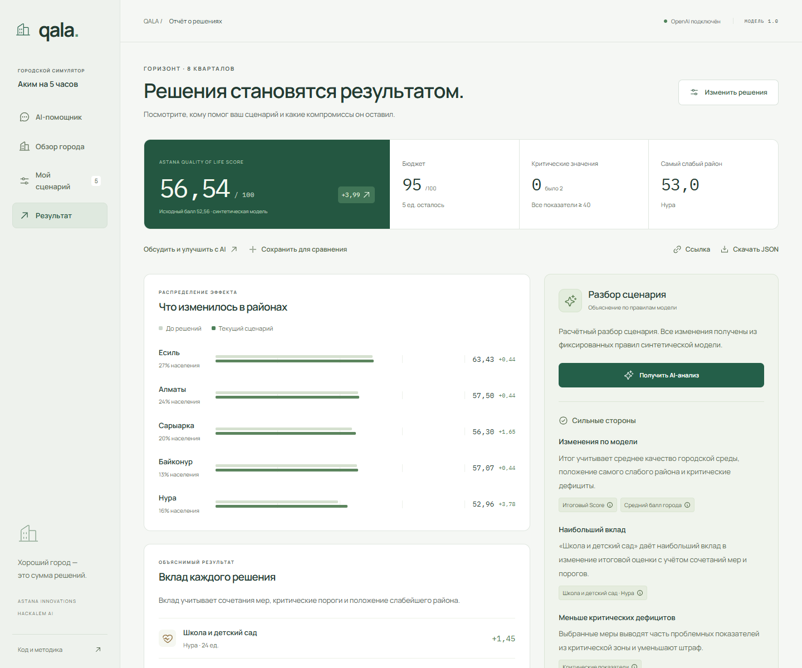
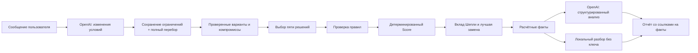

# QALA — Аким на 5 часов

**Обсудите приоритеты. Сравните планы. Проверьте последствия.**

AI-симулятор городского управления для трека **Astana Innovations · HackAlem AI**. Напишите: «Сохрани школу и поликлинику, помоги самому слабому району». QALA переводит запрос в видимые условия, перебирает допустимые планы и показывает компромиссы. Затем можно проверить, что произойдёт при задержке одной из мер. Бюджет — 100 единиц, решений — ровно пять, числовой результат рассчитывается кодом.

[Воспроизводимый пример](docs/DEMO.md) · [Методика](docs/MODEL.md) · [Сверка с оригинальными PDF](docs/SOURCE-AUDIT.md)


## Проверить за две минуты

Требуется **Node.js 22.12+**, рекомендуется Node.js 24. База данных и отдельный backend не нужны.

```bash
git clone https://github.com/BAITC-Hacks/hack-46aa131a-chrollo.git
cd hack-46aa131a-chrollo
npm ci
npm run dev
```

Откройте http://127.0.0.1:3000. Нажмите **«Посмотреть пример» → «Рассчитать сценарий»**. Ожидаемый Score: **56,54307** (на экране 56,54), бюджет 95/100.

Без API-ключа доступны симуляция, сравнение, вклад мер, поиск альтернативы и явно обозначенный **разбор по правилам модели**. Это позволяет проверить приложение сразу после клонирования.

Откройте **«AI-помощник» → «Подобрать планы»**, чтобы проверить полный поиск без ключа. Цель, закрепления и исключения можно задать вручную. Для свободного диалога подключите OpenAI.

## Почему «лучший план» зависит от вопроса

Полный перебор **694 395 допустимых планов** даёт разные ответы:

| Цель                                 | Официальный Score | Балл слабейшего района | Критические показатели |
| ------------------------------------ | ----------------: | ---------------------: | ---------------------: |
| Максимальный общий Score             |     **57,236735** |               54,09125 |                  **0** |
| Максимально помочь слабейшему району |          55,43026 |            **55,2625** |                      2 |

У второго плана сильнее слабейший район, но остаются два критических дефицита, снижающие официальный Score. QALA показывает этот компромисс и позволяет изменить условия, сохраняя одну общую формулу оценки.

Ещё один пример: задержка поликлиники на три квартала снижает результат набора из задания с **56,54307 до 55,30514** и возвращает медицинский показатель Нуры в критическую зону. Это отдельный сценарный эксперимент; официальный результат и бюджет сохраняются.

Все приведённые числа проверяются одной командой, без ключа и платных запросов:

```bash
npm run demo:verify
```

### Подключить OpenAI

Скопируйте `.env.example` в `.env.local`:

```powershell
# Windows PowerShell
Copy-Item .env.example .env.local
```

```bash
# macOS / Linux
cp .env.example .env.local
```

Впишите ключ в локальный файл:

```dotenv
OPENAI_API_KEY=your_api_key_here
OPENAI_MODEL=gpt-4.1-mini
```

Перезапустите сервер и нажмите **«Получить AI-анализ»** в отчёте. При успешном запросе источник изменится на `OpenAI · gpt-4.1-mini`. Ключ используется только на сервере; `.env.local` исключён из Git. Тарификация запросов определяется вашим аккаунтом OpenAI. Дополнительные настройки не нужны.

## Что можно сделать

- **Обсудить приоритеты:** чат помнит текущие условия и недавние сообщения; умеет уточнять запрос, закреплять решения, исключать меры, менять цель и отвечать на вопросы о планах.
- **Подобрать полный план:** исчерпывающий поиск по всем допустимым наборам и назначениям районов. Совпадающие победители по целям объединяются; применение только по кнопке.
- **Проверить задержки:** задержать одну меру на 1–8 кварталов, увидеть изменение Score и возврат дефицитов, сравнить чувствительность всех пяти мер.
- **Изучить город:** пять районов, десять показателей, доли населения и критические дефициты.
- **Собрать сценарий:** выбрать меры из каталога, назначить районы и соблюдать бюджет. Конфликты и недопустимые действия блокируются с объяснением.
- **Понять результат:** увидеть изменения районов, критические значения и точный вклад каждого решения, включая взаимодействие мер.
- **Улучшить сценарий:** сравнить проверенную замену с текущим вариантом и увидеть, какие районы выигрывают или теряют улучшения.
- **Получить AI-анализ:** сильные стороны, риски и рекомендацию со ссылками на вычисленные факты.
- **Сохранить работу:** сравнение двух наборов, локальное сохранение, ссылка на сценарий и полный JSON-отчёт.



## Почему это больше, чем генерация ответа

Числовой результат полностью определяется кодом. Один и тот же набор решений всегда даёт один и тот же Score. Сервер заново проверяет входные решения и не доверяет баллам, присланным клиентом.

**Точные значения Шепли** распределяют общий прирост между мерами с учётом синергий и критических порогов. **Перебор всех допустимых замен одного решения** находит проверяемое улучшение до обращения к LLM. OpenAI объясняет предоставленные результаты, а не придумывает оценку или новый набор мероприятий.

В помощнике **LLM интерпретирует изменения условий**, а сервер сохраняет остальные ограничения и выполняет **полный перебор**. Числовые ответы о найденных планах и задержках формируются непосредственно из расчёта; свободные пояснения AI отделены от этих результатов. Неподдерживаемые требования требуют уточнения. Истолкование запроса может быть ошибочным — условия видимы и редактируются перед применением.

Тезисы AI связаны с раскрываемыми расчётными фактами. Их ID проверяются программно; смысл каждого предложения LLM не считается автоматически доказанным. При недоступном AI приложение сохраняет расчёты и явно переключается на локальное объяснение.



## Контрольные результаты

| Сценарий                   | Бюджет | Критические показатели |        Score |
| -------------------------- | -----: | ---------------------: | -----------: |
| Исходный город             |      0 |                      2 | **52.55768** |
| Пример из датасета         |     95 |                      0 | **56.54307** |
| Проверенная замена M5 → M3 |    100 |                      0 | **57.20556** |

В примере выбраны M7, M8 и M10 в Нуре, M12 по городу, M5 в Сарыарке. Замена M5 на M3 в Нуре повышает Score, но уменьшает оценку Сарыарки относительно предыдущего сценария. Этот компромисс отображается в приложении.

Формула:

```text
Score = 0.7 × средний балл города
      + 0.3 × балл самого слабого района
      − число показателей строго ниже 40
```

Средний балл взвешен по населению. Эффекты учитывают задержки на горизонте восьми кварталов. [Полная методика и правила](docs/MODEL.md).

## Соответствие заданию

| Требование                                      | Реализация                                                                        |
| ----------------------------------------------- | --------------------------------------------------------------------------------- |
| Одинаковый виртуальный бюджет и исходные данные | Фиксированный датасет, бюджет 100, версия модели `astana-1.0`                     |
| Решения по направлениям развития                | Каталог всех пяти направлений; ровно пять мер, максимум две из одного направления |
| Контроль превышения бюджета                     | Проверка в интерфейсе и повторная валидация на сервере                            |
| AI-анализ                                       | OpenAI Responses API + Zod Structured Outputs                                     |
| Astana Quality of Life Score                    | Детерминированная формула с контрольными тестами                                  |
| Сильные стороны, риски и последствия            | Вклад мер, районные изменения, AI-тезисы с фактами, последствия альтернативы      |
| Воспроизводимость                               | Lockfile, `.env.example`, тесты, CI и сценарий проверки                           |

**Выбранное прочтение правил:** подробный датасет разрешает пять мер из минимум трёх направлений и содержит пример без транспорта. QALA следует ему. Неоднозначность общего условия описана в [методике](docs/MODEL.md#неоднозначность-исходного-условия).

## Проверки и production-запуск

```bash
npm run check        # TypeScript + тесты + production-сборка
npm run start        # запуск собранного приложения
```

Дополнительно: `npm test`, `npm run test:watch`, `npm run format:check`. CI запускает проверки без API-ключа. [Описание тестов и ручной сценарий](docs/TESTING.md).

## Технологии и устройство

**Next.js 16 · React 19 · TypeScript · OpenAI SDK · Zod · Vitest · CSS.** Шрифты Manrope и IBM Plex Mono поставляются локально через npm. Иконки — Phosphor. База данных не требуется.

```text
src/
  app/                Next.js и серверные API
  components/         Обзор, конструктор, отчёт и состояние приложения
  lib/
    data.ts           Исходные данные и типы
    engine.ts         Правила, Score, Шепли, поиск альтернативы
    report.ts         Факты и локальный разбор
docs/                 Методика, архитектура, проверка и скриншоты
tracks/astana innovations/  Исходные материалы трека
```

[Архитектура, роль AI и границы доступа](docs/ARCHITECTURE.md).

## Ограничения и дальнейшее развитие

- Данные и эффекты синтетические. Результаты не являются прогнозом для реальной Астаны; схема районов не географическая.
- Полный поиск оптимален в рамках заданного каталога, условий и выбранной цели. Новые мероприятия и эффекты модель не изобретает.
- Эксперимент задержки меняет только прямой эффект одной меры; синергии сохраняются. Он не моделирует вероятности, перерасход бюджета или реальные строительные сроки.
- Диалог сохраняется при переключении экранов в текущей вкладке, но не после перезагрузки. В OpenAI отправляются последние восемь сообщений и актуальные условия.
- Сценарии сохраняются в браузере. Ссылка работает при доступе к тому же экземпляру приложения; общего хранилища команд нет.
- Сервер рассчитан на локальную проверку. Для публичного многопользовательского запуска нужны аутентификация и общие ограничения расходов API.
- Для реального применения потребуются проверенные данные, калибровка эффектов и участие городских экспертов.

**Команда:** chrollo · **Трек:** Astana Innovations · **Хакатон:** HackAlem AI 2026.
