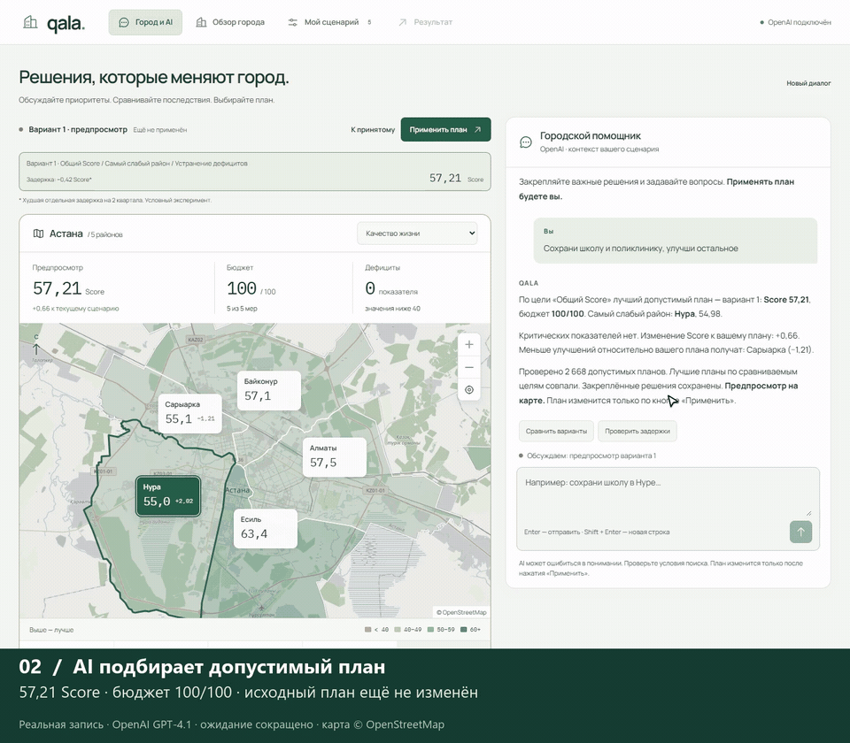
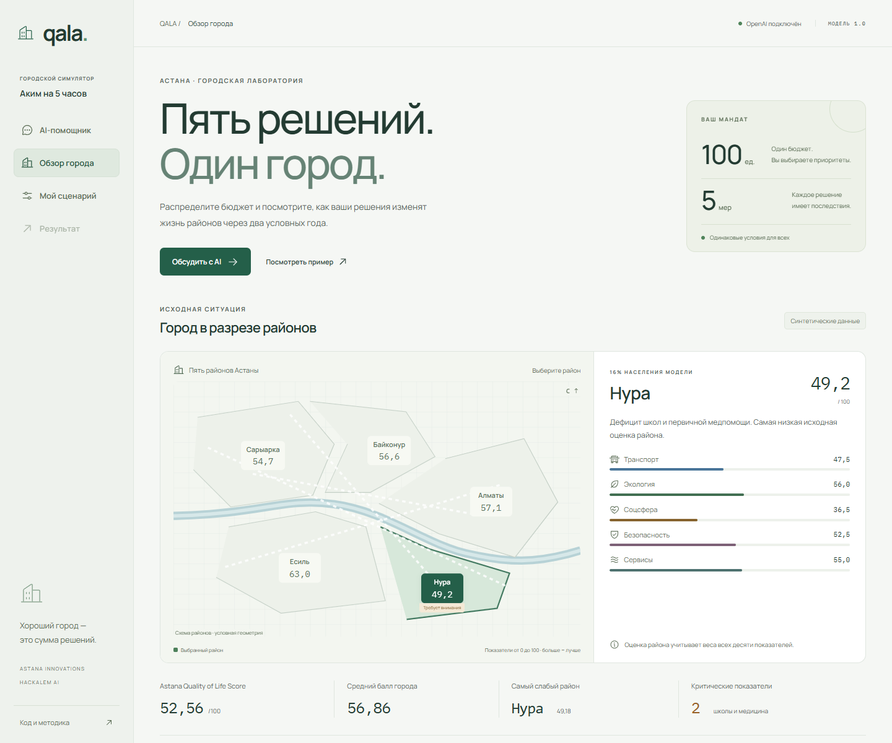
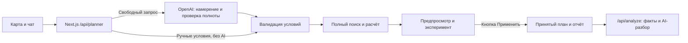

# QALA — Аким на 5 часов

**Обсудите приоритеты. Увидьте последствия. Примите решение.**

**QALA помогает выбрать пять городских инициатив в пределах бюджета и проверить последствия до принятия плана.** Городской управленец, аналитик или участник учебной симуляции обсуждает приоритеты с AI, сравнивает варианты на карте Астаны и проверяет, что произойдёт при задержке работ.

**Astana Innovations · HackAlem AI · команда chrollo**

[Смотреть демо — 51 сек.](docs/media/qala-demo.mp4) · [Запустить](#быстрый-запуск) · [Проверить за 5 минут](#как-проверить-решение) · [Что делает AI](#как-работает-решение) · [Архитектура](#архитектура)

[](docs/media/qala-demo.mp4)

**[Смотреть запись со всеми шагами и русскими подписями — 51 сек., MP4](docs/media/qala-demo.mp4).** Для просмотра ключ и установка не нужны. Показаны реальные ответы OpenAI `gpt-4.1`: закрепление школы и поликлиники → исключение ЛРТ и смена цели → задержка → применение и отчёт. Ожидание ответов сокращено монтажом; GIF выше показывает фрагменты записи.

_В демонстрации поиск ограничен условиями пользователя, поэтому результаты отличаются от глобального максимума ниже. Предложения AI меняют принятый план только после нажатия «Применить план»._

> [!TIP]
> **Для первой проверки OpenAI-ключ не нужен.** Запустите приложение, откройте «Условия поиска» под картой и нажмите «Подобрать планы». Получите воспроизводимый результат: **57,24 Score · бюджет 98/100 · 0 дефицитов**. Свободный диалог подключается отдельно.

## Задача и ценность

У города **100 единиц бюджета**, **5 районов**, **10 показателей** и **14 мероприятий**. Нужно выбрать ровно пять мер с учётом стоимости, задержек, несовместимостей и взаимного усиления. Максимальный общий балл и максимальная помощь слабейшему району могут приводить к разным решениям.

QALA переводит запрос в явные условия, перебирает допустимые планы, показывает последствия на карте и объясняет компромиссы. Полный поиск без дополнительных условий даёт:

| Цель                                | Общий Score | Балл слабейшего района | Показателей ниже 40 |
| ----------------------------------- | ----------: | ---------------------: | ------------------: |
| Максимальный общий Score            |   **57,24** |                  54,09 |               **0** |
| Максимальный балл слабейшего района |       55,43 |              **55,26** |                   2 |

Во втором случае минимальный районный балл выше, но остаются дефициты школ и медицины в Нуре. **Приложение показывает цену выбранного приоритета.** Оба результата получены из **694 395 допустимых планов**. [Точные числа и воспроизводимый пример](docs/DEMO.md).

Это позволяет обсуждать конкретный выбор: кому достанутся улучшения, какие дефициты останутся и чем придётся пожертвовать. Например, в контрольном плане задержка поликлиники на три квартала снижает медицинский показатель Нуры до **38,5** и возвращает штраф за дефицит — даже при неизменном бюджете.

## Что реализовано

- **Город и чат рядом.** Карта Астаны на реальных границах OpenStreetMap: масштабирование, выбор районов, переключение десяти показателей и изменения относительно базы сравнения. На телефоне — вкладки карты и диалога.
- **Подбор через диалог.** Закрепление решений, исключение мер, смена цели, сравнение и объяснение. Условия можно проверить и изменить вручную. Ответы поддерживают Markdown, списки и таблицы.
- **Полный поиск.** Перебор допустимых наборов и назначений районов; победители по нескольким целям. Неупомянутые условия сохраняются.
- **Предпросмотр и отдельное применение.** Найденный вариант появляется на карте. Переключение вариантов и эксперименты не заменяют принятый план; итог применяется кнопкой.
- **Проверка задержек.** Для каждого кандидата автоматически проверяется задержка каждой из пяти мер на два квартала. В отдельном эксперименте можно выбрать меру и задержку от 1 до 8 кварталов; карта показывает последствия.
- **Конструктор и отчёт.** Контроль бюджета и конфликтов, сравнение сценариев, точный вклад Шепли, лучшая замена одной меры, AI-анализ с раскрываемыми фактами, JSON-экспорт и ссылка на сценарий.

<details>
<summary><strong>Статичные скриншоты: подбор, обзор города и эксперимент</strong></summary>

**Подбор:** город и диалог рядом; найденный план ещё не применён.


**Обзор города:** исходные показатели, выбор района и десять тематических слоёв.



**Эксперимент:** задержка дворовых спорт-хабов в найденном плане на два квартала снижает Score с 57,24 до 56,14. Принятый план остаётся прежним.


</details>

## Как работает решение

1. **Задать приоритет:** например, «Сохрани школу и поликлинику, улучши остальное». Можно задать условия вручную или собрать план в конструкторе.
2. **Проверить условия:** OpenAI преобразует сообщение в структурированное намерение. Сервер проверяет изменения и сохраняет остальные ограничения. Перед поиском или экспериментом отдельный вызов модели проверяет полноту перевода: неподдерживаемое требование должно привести к уточнению, без изменения плана.
3. **Исследовать варианты:** код рассчитывает планы; карта показывает предпросмотр, бюджет, дефициты и районные изменения. Можно сравнить другую цель и проверить задержку, продолжая диалог.
4. **Применить предложение:** найденный вариант заменяет текущий сценарий после нажатия «Применить план». В ручном конструкторе пользователь редактирует сценарий напрямую. Раздел «Результат» содержит подробный разбор и экспорт.

Формула из датасета:

```text
Score = 0.7 × средний районный балл с учётом населения
      + 0.3 × балл слабейшего района
      − количество показателей строго ниже 40
```

Горизонт — восемь кварталов; прямые эффекты учитывают лаг, бонусы сочетаний фиксированы. **LLM не вычисляет официальный Score.** Числовые ответы о найденных планах и задержках формируются программно. [Правила и контрольные расчёты](docs/MODEL.md).

| Кто отвечает     | За что                                                                            |
| ---------------- | --------------------------------------------------------------------------------- |
| AI               | Понимание запроса, проверка его перевода и объяснение рассчитанных фактов         |
| Расчётный движок | Допустимость плана, полный поиск, Score, районные эффекты, задержки и вклад Шепли |
| Пользователь     | Проверка видимых условий и применение выбранного плана отдельной кнопкой          |

## Быстрый запуск

Нужны **Git**, **Node.js 22.12+** и **npm**; рекомендуется Node.js 24. База данных, аккаунт в приложении и отдельный backend не требуются.

```bash
git clone https://github.com/BAITC-Hacks/hack-46aa131a-chrollo.git
cd hack-46aa131a-chrollo
npm ci
npm run dev
```

Откройте **http://127.0.0.1:3000**. Начальный экран — «Город и AI».

### Подключение OpenAI — необязательно

Создайте `.env.local` из примера:

```powershell
# Windows PowerShell
Copy-Item .env.example .env.local
```

```bash
# macOS / Linux
cp .env.example .env.local
```

Укажите в `.env.local` и перезапустите сервер:

```dotenv
OPENAI_API_KEY=your_api_key_here
OPENAI_MODEL=gpt-4.1
```

«OpenAI подключён» в шапке означает наличие ключа; его работоспособность проверяется первым сообщением. Ключ используется сервером, файл исключён из Git. Запросы оплачиваются в аккаунте владельца ключа.

### Production и опубликованная версия

```bash
npm run build
npm run start
```

Приложение открывается на `127.0.0.1:3000`; dev-сервер на этом порту нужно предварительно остановить. **Публичная демоверсия не опубликована.** Решение запускается локально из этого репозитория.

## Как проверить решение

Основной маршрут занимает около пяти минут после установки зависимостей. Он работает без ключа, регистрации и базы данных.

### Основной путь без API-ключа

1. **«Город и AI» → «Новый диалог» → «Условия поиска» под картой → «Подобрать планы».** Сброс диалога убирает прежние условия и сохраняет принятый план. Цель — «Общий Score», без закреплений и исключений.
2. Проверено **694 395** допустимых планов. На карте появится **предпросмотр**: Score **57,24**, бюджет **98/100**, дефицитов **0**. План ещё не применён.
3. Переключите вариант **«Самый слабый район»** над картой: Score **55,43**, дефицитов **2**, минимальный районный балл **55,26**.
4. Верните первый вариант, нажмите **«Применить план»**, затем **«Результат»**. Изучите вклад решений и скачайте JSON с точными значениями.

### Контрольный пример организаторов

**«Обзор города» → «Посмотреть пример» → «Рассчитать сценарий».**

| Проверка                                               | Ожидаемый результат                                      |
| ------------------------------------------------------ | -------------------------------------------------------- |
| Набор                                                  | M7, M8, M10 в Нуре; M12 по городу; M5 в Сарыарке         |
| Бюджет / Score / дефициты                              | **95 / 56,54307 / 0**                                    |
| Замена M5 в Сарыарке на M3 в Нуре                      | **100 / 57,20556 / 0**; у Сарыарки меньше улучшений      |
| В исходном примере: задержка поликлиники на 3 квартала | **Score 55,30514**; медицина Нуры **38,5**; один дефицит |

Для последней проверки **не применяйте замену**: в отчёте исходного примера откройте «Если сроки сдвинутся», выберите три квартала и семейную поликлинику. Эксперимент не меняет официальный результат.

### С OpenAI

Загрузите контрольный пример, откройте «Город и AI» и нажмите «Новый диалог». Напишите **«Сохрани школу и поликлинику, улучши остальное»**, затем **«Теперь помоги самому слабому району»**. Проверьте сохранение обоих закреплений в «Условиях поиска». Сравните варианты кнопкой в чате. Строка «Обсуждаем» показывает, к какому предпросмотру или эксперименту относятся вопросы. Применение остаётся за пользователем.

Числа проверяются без API и платных вызовов:

```bash
npm run demo:verify  # контрольный пример, полный поиск и задержка
npm run check        # TypeScript, все тесты, production-сборка
npm run format:check
```

### Что проверено

| Проверка на 23 сентября 2026             | Результат и подтверждение                                                                                                      |
| ---------------------------------------- | ------------------------------------------------------------------------------------------------------------------------------ |
| Расчёты, ограничения, API и геоданные    | **66 тестов прошли**; `npm test`                                                                                               |
| Типы, production-сборка и форматирование | `npm run check` и `npm run format:check` прошли локально                                                                       |
| Живой AI-диалог                          | **30 из 30 запросов** прошли проверку ожидаемого действия с `gpt-4.1`; [сохранённые результаты](docs/planner-evaluation.json)  |
| Интерфейс                                | Проверены 1440 × 1100 и 390 × 844, предпросмотр, задержки, сохранение плана и отказ фоновой карты; [протокол](docs/TESTING.md) |

30 запросов — небольшой регрессионный набор, а не гарантия точности на произвольной формулировке. [Полный маршрут демонстрации](docs/DEMO.md) · [Сверка исходных PDF](docs/SOURCE-AUDIT.md).

> [!NOTE]
> GitHub Actions настроен, но на момент проверки задания не стартуют из-за биллинга аккаунта владельца. Приведённые результаты получены локально; подробности и диагностическое сообщение — в [статусе CI](docs/TESTING.md).

## Технологии

| Слой              | Используется                                                                          |
| ----------------- | ------------------------------------------------------------------------------------- |
| Приложение и API  | Next.js 16, React 19, TypeScript, Node.js                                             |
| AI                | OpenAI JavaScript SDK, Responses API, Structured Outputs; `gpt-4.1` по умолчанию      |
| Проверка структур | Zod                                                                                   |
| Интерфейс         | CSS, SVG, Phosphor, Leaflet / OpenStreetMap; локальные шрифты Manrope и IBM Plex Mono |
| Markdown          | `react-markdown`, `remark-gfm`; сырой HTML отключён                                   |
| Проверки          | Vitest, TypeScript, Prettier; браузерные проверки через agent-browser и axe-core      |
| Хранение          | `localStorage` для сценария и одного набора сравнения; без базы данных                |

## Архитектура

Основной путь подбора плана:



| Компонент                                                                                                            | Ответственность                                           |
| -------------------------------------------------------------------------------------------------------------------- | --------------------------------------------------------- |
| [`data.ts`](src/lib/data.ts), [`engine.ts`](src/lib/engine.ts)                                                       | Датасет, правила, Score, Шепли и проверенная замена       |
| [`planner.ts`](src/lib/planner.ts), [`planning-intent.ts`](src/lib/planning-intent.ts)                               | Полный перебор и сохранение ограничений                   |
| [`resilience.ts`](src/lib/resilience.ts)                                                                             | Задержка одной меры и пересчёт последствий                |
| [`geographic-map.tsx`](src/components/geographic-map.tsx), [`astana-districts.json`](src/data/astana-districts.json) | Интерактивная карта и сохранённые границы районов         |
| [`planner-chat.tsx`](src/components/planner-chat.tsx), [`city-map.tsx`](src/components/city-map.tsx)                 | Диалог, предпросмотр, карта и отдельное применение        |
| [`/api/planner`](src/app/api/planner/route.ts), [`/api/analyze`](src/app/api/analyze/route.ts)                       | Серверная валидация, повторный расчёт, обращения к OpenAI |

Клиент и сервер используют общий расчётный модуль. Сервер заново считает результат и не доверяет присланным баллам. Свободное объяснение LLM может ошибаться; вычисленные факты доступны для проверки. [Архитектура и границы AI](docs/ARCHITECTURE.md).

## Данные и интеграции

Источник — **синтетический датасет организаторов Astana Innovations**: районы, доли населения, веса, меры, стоимость, лаги, конфликты и синергии. [Исходные материалы](<tracks/astana innovations/>) включают скачанные PDF. [Сверка с оригиналами](docs/SOURCE-AUDIT.md) подтверждает перенос данных и правил в код.

QALA следует подробным правилам датасета: ровно пять разных мер, максимум две из одного направления; охват всех пяти направлений не обязателен. Неоднозначность общего описания задания разобрана в [методике](docs/MODEL.md#неоднозначность-исходного-условия).

OpenAI получает последние восемь сообщений, условия и обсуждаемые сценарии; ключ остаётся на сервере. Карта использует Leaflet, сохранённые границы OpenStreetMap и уличную подложку OSM, для которой нужен интернет. Для соответствия пяти районам датасета Сарайшык объединён с Алматы: это учебное представление, а не актуальное административное деление. Без подложки границы и расчёты остаются доступны. [Источники и лицензия геоданных](docs/MAP-DATA.md). Подключений к городским системам и персональным данным нет.

## Ограничения текущей версии

- **Учебные данные и фиксированные правила.** Результаты относятся к датасету организаторов, бюджету 100 и заданному каталогу мер. Они не являются прогнозом для реальной Астаны. Эксперимент задержки меняет прямой эффект одной меры, сохраняя синергии и бюджет; вероятности и перерасход не моделируются.
- **Индивидуальный режим.** План хранится в браузере, диалог и предпросмотр — до перезагрузки. Команды, роли (RBAC) и совместное редактирование не реализованы. Ссылка на сценарий требует доступа к тому же экземпляру приложения.
- **Границы AI.** Модель может ошибиться в интерпретации; условия видны пользователю и требуют проверки. Произвольные требования вне поддерживаемых целей и ограничений не оптимизируются.
- **Локальный запуск.** Для публичного многопользовательского сервиса нужны аутентификация, серверное хранилище и общий контроль расходов API. Текущие лимиты запросов и кэш действуют в пределах процесса.
