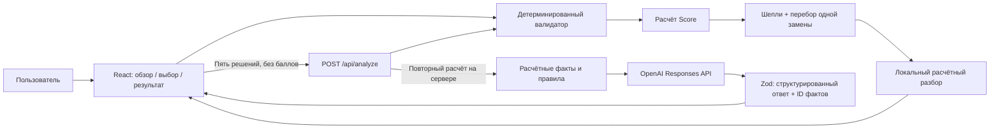

# Архитектура и AI

## Модули

| Путь                           | Ответственность                                           |
| ------------------------------ | --------------------------------------------------------- |
| `src/lib/data.ts`              | Типизированный датасет, ограничения, контрольные сценарии |
| `src/lib/engine.ts`            | Валидация, эффекты, Score, вклад Шепли, поиск замены      |
| `src/lib/report.ts`            | Факты для объяснения и локальный разбор                   |
| `src/components/overview.tsx`  | Обзор и выбор района                                      |
| `src/components/builder.tsx`   | Каталог мер, ограничения и бюджет                         |
| `src/components/results.tsx`   | Сравнение, вклад, альтернативы, AI и таблица              |
| `src/components/simulator.tsx` | Навигация, сохранение, запросы, экспорт                   |
| `src/app/api/analyze/route.ts` | Серверная проверка, Responses API, кэш и fallback         |
| `src/app/api/status/route.ts`  | Признак настройки AI без раскрытия ключа                  |

Одна Next.js-программа запускает интерфейс и сервер. База данных, внешняя карта и отдельный Python-сервис не требуются. Шрифты устанавливаются через npm и отдаются локально. Сценарий и один набор для сравнения сохраняются в `localStorage` с версией формата. Ссылка кодирует только ID выбранных мер и районов.

## Роль OpenAI

Используется официальный JavaScript SDK, **Responses API** и **Structured Outputs** через `zodTextFormat`. Модель по умолчанию — `gpt-4.1-mini`; её можно изменить через `OPENAI_MODEL` на доступную модель, поддерживающую этот интерфейс.

AI получает рассчитанные факты, а не задачу вычислить результат: бюджет, Score до/после, изменения районов, критические значения, вклад Шепли, лаги, неизменённые показатели и последствия проверенной альтернативы. Модель формирует краткий вывод, сильные стороны, риски и рекомендацию. Каждый тезис ссылается на ID фактов; пользователь может раскрыть их прямо в интерфейсе.

Сервер проверяет структуру ответа и существование ID. **Это не автоматическое доказательство истинности каждого предложения LLM.** Ошибочные интерпретации возможны; исходные расчётные факты остаются видимыми, а числовая оценка никогда не берётся из ответа AI. Промпт ограничивает рекомендации проверенной альтернативой и запрещает перенос выводов на реальный город.

Мы не заявляем мультиагентную систему: это детерминированный симулятор с одним вызовом аналитической модели по кнопке. Проверяемая альтернатива находится обычным алгоритмом до вызова LLM.

## Поведение при недоступном AI

Без API-ключа, при таймауте, ошибке провайдера, отказе или некорректных ссылках на факты приложение показывает явно обозначенный **разбор по правилам модели**. Score, сравнение, Шепли, альтернатива и экспорт работают независимо от OpenAI. Локальный текст не выдаётся за ответ AI.

API имеет таймаут 25 секунд и не делает автоматических повторов. Кэш хранит до 100 ответов на 30 минут. Ограничение — 6 новых AI-запросов в минуту и 2 параллельных запроса на процесс. Повторный запрос того же набора обычно использует кэш; после перезапуска сервера кэш пуст.

## Данные и границы доступа

- `OPENAI_API_KEY` читается только сервером из `.env.local`. В Git и браузер ключ не передаётся.
- Отправляется только синтетический сценарий; свободного пользовательского промпта нет. Лишние поля запроса отбрасываются.
- Клиентские баллы не принимаются: сервер заново валидирует и рассчитывает сценарий.
- Тело запроса ограничено 4096 байт; переполнение прекращает чтение потока.
- Для браузерных запросов проверяется соответствие Origin входному Host.
- Вызовы OpenAI используют `store: false`; это настройка сохранения Response, а не обещание особого режима хранения данных у провайдера.
- Сообщения SDK не возвращаются пользователю, чтобы не раскрывать служебные данные.

Приложение по умолчанию слушает только `127.0.0.1`. Аутентификации нет; лимиты и кэш локальны для процесса. Для открытого многопользовательского размещения нужны контроль доступа, общий лимитер и бюджет API. Ссылка на сценарий работает у получателя только при доступе к тому же экземпляру приложения.

## Официальные документы

- [OpenAI Structured Outputs](https://developers.openai.com/api/docs/guides/structured-outputs)
- [GPT-4.1 mini](https://developers.openai.com/api/docs/models/gpt-4.1-mini)
- [Next.js Route Handlers](https://nextjs.org/docs/app/getting-started/route-handlers)
