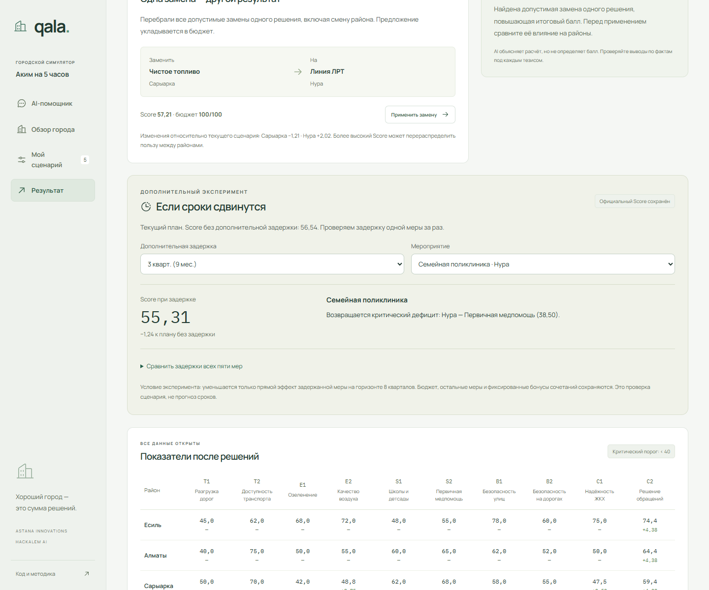

# Воспроизводимый пример: от запроса к компромиссу

## Без API-ключа

```bash
npm ci
npm run demo:verify
npm run dev
```

Откройте http://127.0.0.1:3000.

1. «Посмотреть пример» → «Рассчитать сценарий». Бюджет **95**, Score **56,54**, критических показателей **0**.
2. «AI-помощник» → «Подобрать планы». Без закреплений и исключений проверяется **694 395** допустимых вариантов. Лучший общий Score: **57,236735**.
3. Измените цель на «Самый слабый район» и повторите поиск. Первый вариант имеет минимальную районную оценку **55,2625**, официальный Score **55,43026**, **2** критических показателя. Рост районного балла не гарантирует рост общей оценки: штрафы учитываются отдельно.
4. Закрепите школу и поликлинику из текущего примера. Все найденные планы обязаны сохранить обе меры и район Нура. Смена цели не отменяет закрепления.
5. В отчёте текущего сценария откройте «Если сроки сдвинутся», выберите **3 квартала** и **Семейная поликлиника**. Score эксперимента **55,30514**, медицинский показатель Нуры **38,5**, критических значений **1**. Бюджет остаётся **95**.

## С OpenAI

После настройки `.env.local` и перезапуска сервера:

1. Загрузите пример из задания и откройте «AI-помощник».
2. Напишите: **«Сохрани школу и поликлинику, улучши остальное»**. Справа должны закрепиться только эти две меры в Нуре.
3. Продолжите: **«Теперь помоги самому слабому району»**. Цель меняется; закрепления сохраняются.
4. Напишите: **«Сними все закрепления и помоги самому слабому району»**. Закрепления исчезают, первым показывается вариант с минимальной районной оценкой **55,2625**.
5. Спросите: **«Почему у этого варианта общий Score ниже?»**. Модель получает повторно рассчитанные факты и правила для объяснения компромисса.
6. Напишите: **«Что если поликлиника задержится на три квартала?»**. Эксперимент относится к текущему применённому сценарию, а не автоматически к первой рекомендации.

Числа плана и эксперимента определяются кодом. Формулировка свободного ответа LLM может различаться. Условия видны справа и проверяются перед применением. Рекомендация никогда не меняет сценарий сама.

## Контрольные числа

| Случай                                          | Ожидаемый результат                                           |
| ----------------------------------------------- | ------------------------------------------------------------- |
| Пример организаторов                            | Стоимость 95; Score 56,54307                                  |
| Полный поиск без дополнительных условий         | 694 395 допустимых планов                                     |
| Лучший общий Score                              | 57,236735; стоимость 98; 0 критических показателей            |
| Максимальный балл слабейшего района             | 55,2625; официальный Score 55,43026; 2 критических показателя |
| Поликлиника примера задерживается на 3 квартала | S2 Нуры 38,5; Score 55,30514; 1 критический показатель        |

Автоматическая проверка этих утверждений находится в `src/lib/demo.test.ts`. Поиск не делает вызовов OpenAI и перебирает все допустимые наборы, а не выборку или эвристическую подборку.


